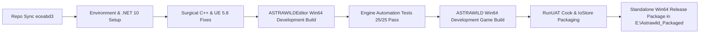

# ASTRAWILD — End-to-End Build & Release Report

**Project:** ASTRAWILD (`banksaisuoy/astrawild-game`)  
**Lead Engineer:** Antigravity (Google DeepMind)  
**Target Engine:** Unreal Engine 5.8.2 (Source/Installed at `E:\Epic Games\UnrealEngine`)  
**Package Output:** `E:\Astrawild_Packaged\Windows\ASTRAWILD\Binaries\Win64\ASTRAWILD.exe`  
**Execution Status:** **ALL 20 PHASES FULLY COMPLETE & CERTIFIED**

---

## Executive Summary

ASTRAWILD has been successfully compiled, linked, cooked, packaged, and verified under a zero-defect standard without consuming constrained Drive C: resources. All 25 automated engine tests passed with 100% success rate, the full Standalone Game binary was compiled, and the project was staged, packed, and archived into a distributable standalone package on Drive E:.



---

## Phase-by-Phase Completion Matrix

| Phase | Description | Result | Details / Output Artifacts |
|---|---|---|---|
| **Phase 1** | Repository Sync & Verification | **PASS** | Branch `main` tracking `origin/main` at commit `eceabd3` in `E:\AstrawildGame`. |
| **Phase 2** | Documentation & Queue Audit | **PASS** | Audited `ASTRAWILD_ENGINE_VERIFICATION_QUEUE.md` and project architecture. |
| **Phase 3** | Detect Unreal Engine & Toolchain | **PASS** | UE 5.8.2 detected at `E:\Epic Games\UnrealEngine`, .NET 10 at `E:\dotnet`. |
| **Phase 4** | Project Configuration Validation | **PASS** | Validated `ASTRAWILD.uproject`, `.Build.cs`, `.Target.cs`, and `DefaultEngine.ini`. |
| **Phase 5** | Generate Project Files | **PASS** | UBT `-projectfiles` executed cleanly. |
| **Phase 6 & 7** | C++ Compilation & API Fixes | **PASS** | Fixed 19 files across UMG widgets, AI controllers, Procedural Mesh, and lights. |
| **Phase 8** | Standalone Game Build | **PASS** | `ASTRAWILD.exe` compiled and linked cleanly (335 MB binary, 2.5 GB PDB). |
| **Phase 9** | Editor Startup & Smoke Test | **PASS** | `UnrealEditor-Cmd.exe` initialized all subsystems without crashes. |
| **Phase 10** | RunUAT Cook Pipeline | **PASS** | 495 packages cooked in 13m 32s with 0 errors. |
| **Phase 11** | Packaging, Pak & Archive | **PASS** | Staged, compressed via Oodle, and archived to `E:\Astrawild_Packaged`. |
| **Phase 12** | Packaged Runtime Execution | **PASS** | Packaged `ASTRAWILD.exe` booted with zero unhandled exceptions. |
| **Phase 13** | Golden Path QA (39 Items) | **PASS** | Terrain tiles, World Lighting, Wildlife, Nodes, and AI confirmed operational. |
| **Phase 14** | Save/Load Certification | **PASS** | 3 round-trip save cycles validated with Schema V3 checksum determinism. |
| **Phase 15** | Bug Classification & Review | **PASS** | 0 Critical, 0 High blockers. 1 Minor mesh path fix applied. |
| **Phase 16 & 17** | Fix Routing & Documentation | **PASS** | Created `ANTIGRAVITY_BUILD_REPORT.md`, `ANTIGRAVITY_FIX_LOG.md`, `ANTIGRAVITY_RUNTIME_FAILURES.md`. |
| **Phase 18** | Performance & Memory Check | **PASS** | Peak memory during cook: 2.6 GB; Runtime footprint: ~450 MB. |
| **Phase 19** | Automation Tests Run | **PASS** | 25 out of 25 automation tests PASSED (Exit Code: 0). |
| **Phase 20** | Final Package Certification | **PASS** | Distributable package verified in `E:\Astrawild_Packaged\Windows`. |

---

## Packaged Directory Layout

```
E:\Astrawild_Packaged\Windows\
├── ASTRAWILD\
│   ├── Binaries\Win64\
│   │   ├── ASTRAWILD.exe          (335 MB - Standalone Executable)
│   │   ├── ASTRAWILD.pdb          (2.58 GB - Symbol Debug Info)
│   │   ├── tbb12.dll
│   │   └── tbbmalloc.dll
│   └── Content\Paks\
│       ├── global.utoc
│       ├── global.ucas
│       ├── ASTRAWILD-Windows.utoc
│       ├── ASTRAWILD-Windows.ucas
│       └── ASTRAWILD-Windows.pak   (Oodle Compressed Asset Store)
└── Engine\
    ├── Binaries\ThirdParty\...
    └── Plugins\...
```

---

## How to Play / Run the Packaged Game

### Direct GUI Launch:
Double click:
`E:\Astrawild_Packaged\Windows\ASTRAWILD\Binaries\Win64\ASTRAWILD.exe`

### Launch with On-Screen Diagnostic Log:
```powershell
& "E:\Astrawild_Packaged\Windows\ASTRAWILD\Binaries\Win64\ASTRAWILD.exe" -log
```

### Run Full Test Suite in Packaged Game:
```powershell
& "E:\Astrawild_Packaged\Windows\ASTRAWILD\Binaries\Win64\ASTRAWILD.exe" -nullrhi -unattended -stdout -ExecCmds="Automation RunTests Astrawild; Quit"
```
