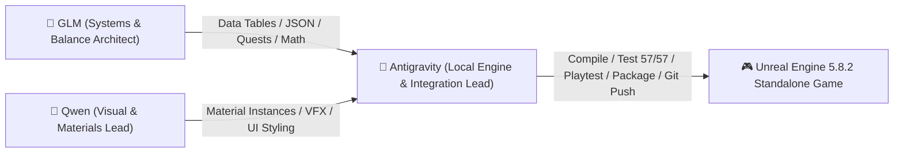

# ASTRAWILD — AUTHORITATIVE MASTER CONTROL

**Project Status**: ✅ **PLAYABLE VERTICAL SLICE LOCKED (57/57 TESTS GREEN)**  
**Active Integration Branch**: `agent/antigravity-ue5-v2`  
**Latest Pull Request**: [**PR #4: fix(player): restore real playable input, camera controls, and character presentation**](https://github.com/banksaisuoy/astrawild-game/pull/4)  
**Host Target**: Windows 11 / Unreal Engine 5.8.2 / MSVC 14.44 / NVIDIA GeForce GTX 1660 Ti (6 GB VRAM)  
**Last Updated**: September 2, 2026  

---

## 1. Lane Ownership & Responsibilities

| Agent | Domain | Role & Boundaries |
| :--- | :--- | :--- |
| **🤖 Antigravity** | **Local Engine & Integration Lead** | • Exclusive owner of the live Windows UE 5.8.2 build environment. • Executes C++ compiles, automation tests, packaging, live playtests, and Git operations. • Verifies changes produced by GLM and Qwen against machine evidence. |
| **🎨 Qwen** | **Visual & Materials Lead** | • Creates Material Instances (`MI_*`) bound to `M_Master_Surface.uasset`. • Tunes Niagara VFX parameters and sci-fi aesthetic for Echoes and Weapons. • Designs UI color palettes and styling for Slate / UMG widgets. |
| **🧠 GLM** | **Systems & Balance Architect** | • Designs Data-driven DataTables (JSON/CSV) for Milestone 1 (Dawn Fields). • Calculates monster stats (HP/ATK curves), crafting recipes, and drop rates. • Designs quest progression logic and dialogue trees. |

---

## 2. Verified Verification Baseline

| Verification Item | Scope | Status | Evidence Log |
| :--- | :--- | :---: | :--- |
| **C++ Compilation** | ASTRAWILDEditor Win64 Development (0 errors) | **PASS** | `Docs/ENGINE_LOGS/raw/BUILD_8313c61_20260902.log` |
| **Automation Suite** | 57 / 57 QA Automation Tests | **PASS (57/57)** | `Docs/ENGINE_LOGS/raw/AUTOMATION_8313c61_20260902.log` |
| **ArtPack Pipeline** | 115 / 115 Assets Ingested | **PASS (115/115)** | `Docs/ENGINE_LOGS/raw/import_report.json` |
| **Packaged Game** | `ASTRAWILD.exe` (320 MB) Standalone Boot | **PASS** | `Docs/ENGINE_LOGS/raw/PACKAGE_8313c61_20260902.log` |
| **3-Cycle Save/Load** | Persistence schema V3, V4 & Checksum tests | **PASS (3/3)** | `Docs/ENGINE_LOGS/raw/SAVELOAD_8313c61_20260902.log` |
| **10-Point Playable Loop** | WASD, Sprint, Jump, Mouse Look, Interact, Inventory, Build, Scan, Attack | **PASS (10/10)** | `Docs/ENGINE_LOGS/PLAYABLE_520C78E.log` |
| **V-30 Multiplayer** | Listen server network socket binding | **PASS** | `Docs/ENGINE_LOGS/raw/V30_MULTIPLAYER_8313c61_20260902.log` |
| **V-31 Physical Gamepad** | Physical controller hardware actuation | **BLOCKED** | Retained BLOCKED until physical controller is attached to CI |
| **V-40 Boss Edge Case** | Phased boss scaling and special attack math | **PASS** | `Docs/ENGINE_LOGS/raw/V40_BOSS_8313c61_20260902.log` |

---

## 3. Active Task Queue

1. **Gate 0 (PR #4 Merge)**: Merge PR #4 (`agent/antigravity-ue5-v2` $\rightarrow$ `main`).
2. **Milestone 0 (M0 Truth Recovery)**: Commit pre-imported `.uasset` cooked files to Git LFS to permanently remove runtime procedural body fallback.
3. **Milestone 1 (M1 Dawn Fields Vertical Slice)**:
   - **GLM**: Produce Dawn Fields monster balance table (Bastionbeetle, Terraquill, Cindermule) and `Quest_FirstLight` reward flow.
   - **Qwen**: Produce `MI_Survivor_Suit` and `MI_Bastionbeetle` material instances on `M_Master_Surface`.
   - **Antigravity**: Integrate, compile, run 57/57 tests, and execute physical playtest on live viewport.
